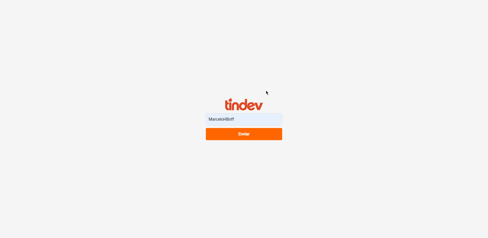
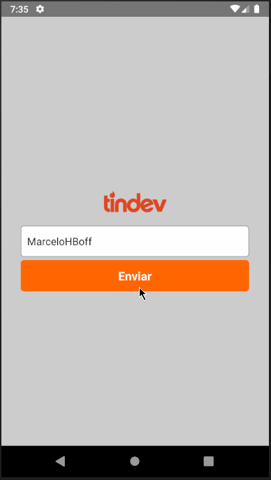

[](https://insomnia.rest/run/?label=Tindev&uri=https%3A%2F%2Fraw.githubusercontent.com%2FMarceloHBoff%2Ftindev%2Fmaster%2Finsomnia.json)

<h1 align="center">Tindev</h1>

<h3>Semana Omnistack 09
  <h4 align="center">
    A FullStack application clone of Tinder but turned to find developers.
  </h4>
</h3>

---

<p align="center">
  

  

  

  
</p>

<h2>📔 Description</h2>

On the backend was used a instance of Mongo Atlas to save the data. In the frontend and mobile aplication its possible make log in using your GITHUB username and see other people registered.

by Rockeseat ❤️

---

`Web Aplication`

<details>
  <summary>See</summary>



</details>

`Mobile`

<details>
  <summary>See</summary>



</details>

<h2>🚀 Technologies</h2>

- [NodeJS](https://nodejs.org)
- [ReactJS](https://reactjs.org/)
- [React Native](https://facebook.github.io/react-native/)
- [Axios](https://github.com/axios/axios)
- [Styled-Components](https://styled-components.com/)
- [Express](https://expressjs.com/pt-br/)
- [MongoDB](https://www.mongodb.com/)
- [Mongo Atlas](https://www.mongodb.com/cloud/atlas)
- [ESLint](https://eslint.org/)
- [Prettier](https://prettier.io/)
- [Web Socket](https://socket.io/)

---

<h2>❓ How to use</h2>

`Backend`

```bash
# Clone this repository
$ git clone https://github.com/MarceloHBoff/tindev/tree/master/backend

# Go into the repository
$ cd tindev/backend

# Install dependencies for the backend
$ yarn

# Run the backend server
$ yarn dev
```

`Frontend`

```bash
# Clone this repository
$ git clone https://github.com/MarceloHBoff/tindev/tree/master/frontend

# Go into the repository
$ cd tindev/frontend

# Install dependencies for the frontend
$ yarn

# Run the frontend
$ yarn start
```

`Mobile`

```bash
# Clone this repository
$ git clone https://github.com/MarceloHBoff/tindev/tree/master/mobile

# Go into the repository
$ cd tindev/mobile

# Install dependencies for the mobile
$ yarn

# Start React Native Server
$ yarn start

```

Made with love by [Marcelo Boff!](https://www.linkedin.com/in/marcelo-boff)
